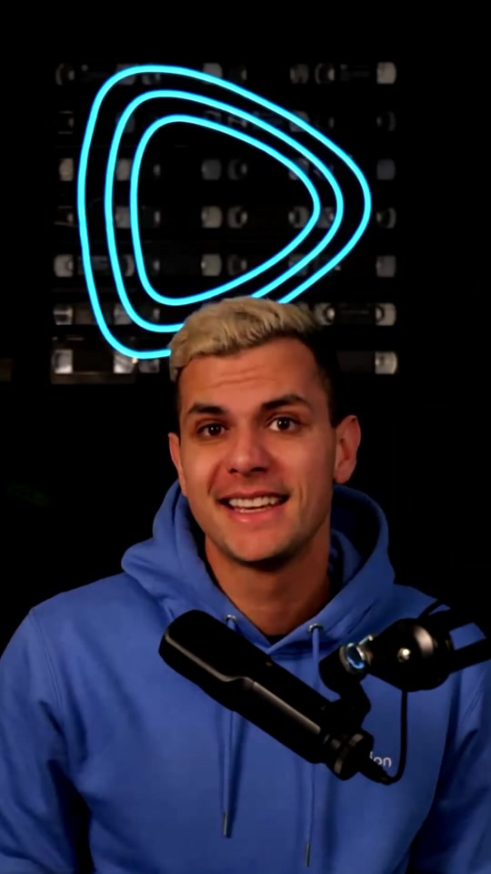
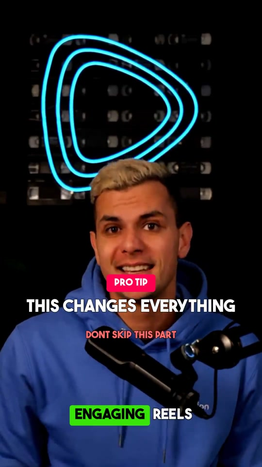
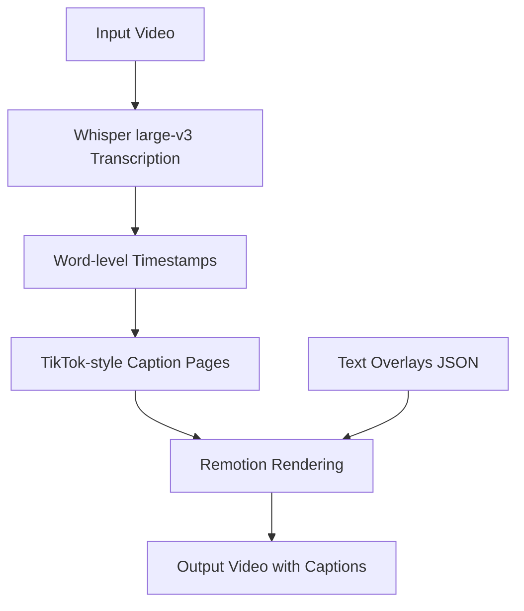

# Video Text Generator

AI-powered TikTok-style video captions using Whisper transcription and Remotion rendering.

[](https://replicate.com/hjunior29/video-text-generator)
[](https://opensource.org/licenses/MIT)

## Overview

This model automatically transcribes videos using OpenAI Whisper and generates TikTok-style karaoke captions with word-by-word highlighting. It supports multiple caption styles, customizable colors, and text overlays for creating engaging social media content.

### Example Results

<div align="center">


*Side-by-side comparison: Original (left) vs. With Captions (right)*

</div>

<details>
<summary>Click to see static comparison</summary>

| Original | With Captions |
|----------|---------------|
|  |  |

</details>

## Features

- **AI Transcription**: Uses OpenAI Whisper large-v3 for accurate speech-to-text
- **Word-by-Word Highlighting**: Karaoke-style captions that highlight each word as it's spoken
- **Multiple Caption Styles**: Choose between "classic" (stroke text) or "boxed" (background boxes)
- **Text Overlays**: Add custom text overlays with precise timing and positioning
- **Customizable Design**: Configure colors, sizes, and positions to match your brand
- **Production Ready**: Deployed on Replicate for easy API access

## How to Use

### Option 1: Replicate Web Interface

Visit [replicate.com/hjunior29/video-text-generator](https://replicate.com/hjunior29/video-text-generator) and upload your video.

### Option 2: API Integration

#### Python

```python
import replicate

output = replicate.run(
    "hjunior29/video-text-generator",
    input={
        "video": open("video.mp4", "rb"),
        "caption_style": "boxed",
        "caption_size": 60,
        "highlight_color": "#39E508",
        "caption_position": 150
    }
)
print(output)
```

#### cURL

```bash
curl -X POST https://api.replicate.com/v1/predictions \
  -H "Authorization: Bearer $REPLICATE_API_TOKEN" \
  -H "Content-Type: application/json" \
  -d '{
    "version": "YOUR_MODEL_VERSION",
    "input": {
      "video": "https://example.com/video.mp4",
      "caption_style": "boxed",
      "caption_size": 60,
      "highlight_color": "#39E508",
      "caption_position": 150
    }
  }'
```

#### Node.js

```javascript
import Replicate from "replicate";

const replicate = new Replicate({
  auth: process.env.REPLICATE_API_TOKEN,
});

const output = await replicate.run(
  "hjunior29/video-text-generator",
  {
    input: {
      video: "https://example.com/video.mp4",
      caption_style: "boxed",
      caption_size: 60,
      highlight_color: "#39E508",
      caption_position: 150
    }
  }
);
console.log(output);
```

## Input Parameters

### `video` (required)
- **Type**: Video file
- **Supported formats**: MP4, MOV, MKV, WebM
- **Description**: Input video to add captions to

### `caption_style` (optional)
- **Type**: String (choice)
- **Default**: `boxed`
- **Options**:
  - `boxed` - Words with background boxes (TikTok/Instagram style)
  - `classic` - Simple text with stroke outline
- **Description**: Visual style for the captions

### `caption_size` (optional)
- **Type**: Integer
- **Default**: 60
- **Description**: Font size for the captions in pixels

### `highlight_color` (optional)
- **Type**: String (hex color)
- **Default**: `#39E508`
- **Description**: Color for the highlighted word (hex format)

### `caption_position` (optional)
- **Type**: Integer
- **Default**: 150
- **Description**: Distance from the bottom of the video in pixels (150 = bottom, 300 = center, 500 = top)

### `text_overlays` (optional)
- **Type**: String (JSON array)
- **Default**: `""`
- **Description**: JSON array of text overlays for custom text elements
- **Example**:
```json
[
  {"text": "TITLE", "startMs": 0, "endMs": 3000, "position": 300, "fontSize": 80, "color": "#FFFFFF"},
  {"text": "Subscribe!", "startMs": 5000, "endMs": 7000, "position": 500, "fontSize": 50, "color": "#FF0000", "backgroundColor": "rgba(0,0,0,0.5)"}
]
```

#### Text Overlay Fields:
- `text` (required): The text to display
- `startMs` (required): Start time in milliseconds
- `endMs` (required): End time in milliseconds
- `position` (optional): Distance from bottom in pixels (default: 300)
- `fontSize` (optional): Font size in pixels (default: 60)
- `color` (optional): Text color in hex (default: "#FFFFFF")
- `backgroundColor` (optional): Background color with opacity (e.g., "rgba(0,0,0,0.5)")

## Common Use Cases

### 1. TikTok/Reels Captions
Add engaging captions to short-form video content:
```python
output = replicate.run(
    "hjunior29/video-text-generator",
    input={
        "video": video_file,
        "caption_style": "boxed",
        "caption_size": 60,
        "highlight_color": "#39E508",
        "caption_position": 150
    }
)
```

### 2. Educational Content
Clean captions with classic styling:
```python
output = replicate.run(
    "hjunior29/video-text-generator",
    input={
        "video": video_file,
        "caption_style": "classic",
        "caption_size": 50,
        "highlight_color": "#FFFF00",
        "caption_position": 100
    }
)
```

### 3. Marketing Videos with Overlays
Add titles and call-to-actions:
```python
output = replicate.run(
    "hjunior29/video-text-generator",
    input={
        "video": video_file,
        "caption_style": "boxed",
        "text_overlays": '[{"text": "NEW PRODUCT", "startMs": 0, "endMs": 2000, "position": 400, "fontSize": 80}, {"text": "Link in Bio!", "startMs": 5000, "endMs": 7000, "position": 500}]'
    }
)
```

## Model Details

### Architecture



**Transcription Model**: OpenAI Whisper large-v3
- **Languages**: Auto-detection with 100+ languages supported
- **Accuracy**: State-of-the-art speech recognition
- **Output**: Word-level timestamps with confidence scores

**Rendering Engine**: Remotion
- **Framework**: React-based video rendering
- **Output**: H.264 encoded MP4
- **Concurrency**: 90% CPU utilization for fast rendering

### Performance Metrics

- **Transcription Speed**: Real-time factor ~0.5x on GPU (2x faster than audio length)
- **Rendering Speed**: ~30 FPS on GPU instances
- **Cold Start Time**: ~5-10 seconds (model loading)
- **GPU Support**: CUDA-enabled (required)

## Intended Uses

### Appropriate Uses

- **Content Creation**: Adding captions to social media videos
- **Accessibility**: Making video content accessible to deaf/hard-of-hearing viewers
- **Marketing**: Creating engaging promotional videos
- **Education**: Adding captions to educational content
- **Localization**: Transcribing content for translation

### Out-of-Scope Uses

- **Copyright Infringement**: Do not use on protected content without rights
- **Misrepresentation**: Do not use to create misleading content
- **Illegal Content**: Do not process content that violates laws or policies

## Limitations

### Technical Limitations

1. **Transcription**:
   - May struggle with heavy background noise
   - Accuracy varies by language and accent
   - Very fast speech may have timing issues

2. **Rendering**:
   - Requires GPU for reasonable processing times
   - Maximum video length depends on memory
   - High-resolution videos take longer to process

3. **Text Overlays**:
   - Must be valid JSON format
   - Overlapping text may cause visual issues

## Troubleshooting

### Poor Transcription Quality

**Solutions**:
- Ensure video has clear audio
- Check that the spoken language is supported
- Reduce background noise in source video

### Rendering Fails

**Solutions**:
- Verify video format is supported (MP4, MOV, MKV, WebM)
- Check text_overlays JSON is valid
- Ensure video file is not corrupted

### Captions Out of Sync

**Solutions**:
- This may happen with very fast speech
- Try shorter video clips
- Report persistent issues for investigation

## System Requirements

### Replicate Deployment (Recommended)
- No local requirements
- Managed GPU infrastructure
- Automatic scaling

### Local Development
- **GPU**: CUDA-enabled GPU required
- **RAM**: 8GB minimum, 16GB recommended
- **Node.js**: Bun runtime
- **Python**: 3.11+
- **FFmpeg**: Latest stable version

## Dependencies

**Python**:
- openai-whisper
- torch (CUDA)
- numpy
- ffmpeg-python

**JavaScript**:
- remotion
- @remotion/captions
- @remotion/layout-utils
- @remotion/animation-utils

## Version History

### Current Version (v1.0.0)
- OpenAI Whisper large-v3 transcription
- 2 caption styles (classic, boxed)
- Word-by-word highlighting
- Text overlays support
- Customizable colors and positioning

### Planned Features
- Additional caption styles
- Emoji support
- Multi-speaker detection
- Custom fonts

## Citations and Acknowledgments

### Technologies Used

- **OpenAI Whisper**: Speech recognition model
  - Radford, A., Kim, J. W., Xu, T., Brockman, G., McLeavey, C., & Sutskever, I. (2022). Robust Speech Recognition via Large-Scale Weak Supervision.

- **Remotion**: React-based video rendering
  - Remotion Contributors. (2023). Remotion - Create videos programmatically in React. https://remotion.dev

- **Bun**: Fast JavaScript runtime
  - Oven. (2023). Bun - Fast all-in-one JavaScript runtime. https://bun.sh

### Development

Developed by [Helder Lima](https://github.com/hjunior29)

Built with [Cog](https://github.com/replicate/cog) for easy deployment on [Replicate](https://replicate.com)

## Support and Contact

- **Issues**: [GitHub Issues](https://github.com/hjunior29/video-text-generator/issues)
- **Discussions**: [GitHub Discussions](https://github.com/hjunior29/video-text-generator/discussions)
- **Replicate Model**: [hjunior29/video-text-generator](https://replicate.com/hjunior29/video-text-generator)

## Contributing

Contributions are welcome! Areas for contribution:
- Additional caption styles
- Performance optimizations
- Documentation improvements
- Bug reports and fixes

---

**Note**: This tool is provided for legitimate video editing and content creation purposes. Users are responsible for ensuring they have appropriate rights and permissions for any content they process.

## License

This project is licensed under the MIT License - see the [LICENSE](LICENSE) file for details.

**MIT License Summary:**
- Commercial use allowed
- Modification allowed
- Distribution allowed
- Private use allowed
- Liability and warranty disclaimers apply
